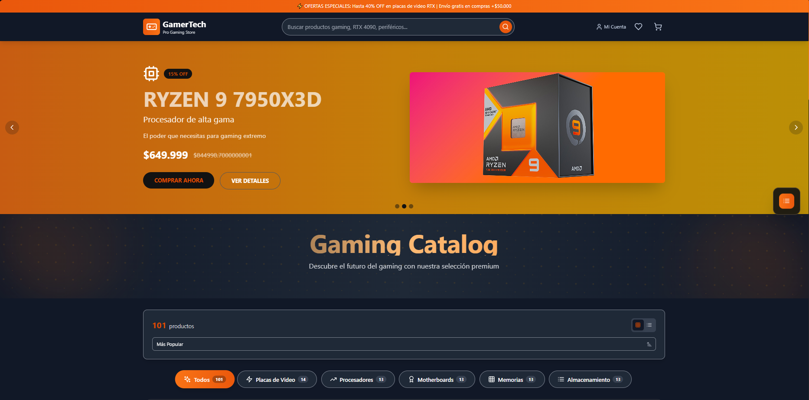

# GamerTech - Pro Gaming Store

¡Bienvenido a **GamerTech**! Esta es una tienda web ultra moderna de hardware y periféricos gamer, desarrollada con las mejores tecnologías frontend para brindar una experiencia de usuario profesional, rápida y completamente responsive, adaptándose a cualquier dispositivo.

Este proyecto es una **remasterización** completa de una versión anterior que desarrollé con el mismo nombre con el fin hacer una demostracion de skills. En esta nueva versión, he mejorado el diseño, optimizado el rendimiento y añadido funcionalidades modernas para ofrecer una plataforma de compra más atractiva y eficiente para los entusiastas del gaming.

---

  <h3>🎮 GamerTech</h3>
  
E-commerce Moderno sobre Gaming

  

## 🎮 Características Principales

- **Catálogo de productos** con imágenes locales y detalles completos
- **Carrito de compras** funcional y persistente
- **Favoritos** (wishlist) con persistencia
- **Búsqueda avanzada** y filtrado por categorías
- **Animaciones modernas** y microinteracciones
- **Diseño 100% responsive** (mobile, tablet, desktop)
- **Modales de producto** y carrito
- **Botón "Cargar más"** para paginación progresiva
- **Newsletter** y footer profesional
- **Soporte para dark mode**

---

## ✨ Experiencia de Usuario

- **Mobile First:** Navegación y compra optimizadas para celulares y tablets.
- **Animaciones suaves:** Transiciones, hover, feedback visual y microinteracciones.
- **Accesibilidad:** Contrastes, foco y navegación por teclado.
- **Carga rápida:** Imágenes locales y optimización de recursos.

---

## 📢 Créditos y Licencia

- **Desarrollado por:** [Facundo Carrizo]

Este proyecto es open source. ¡Siéntete libre de mejorarlo y compartirlo!
